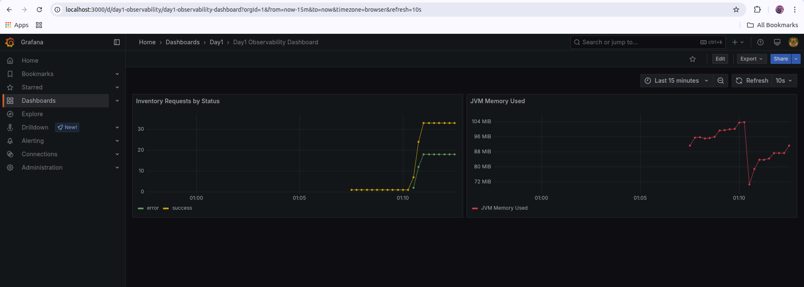
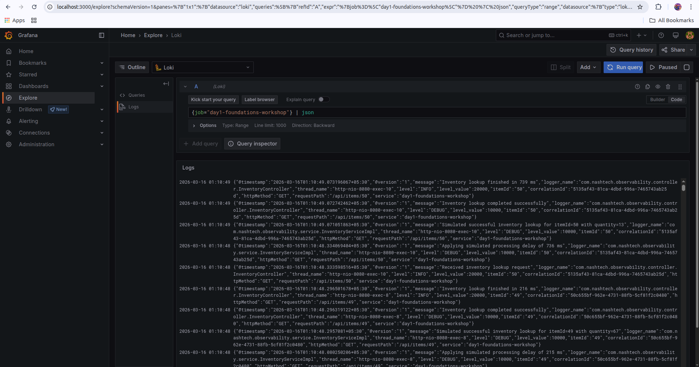
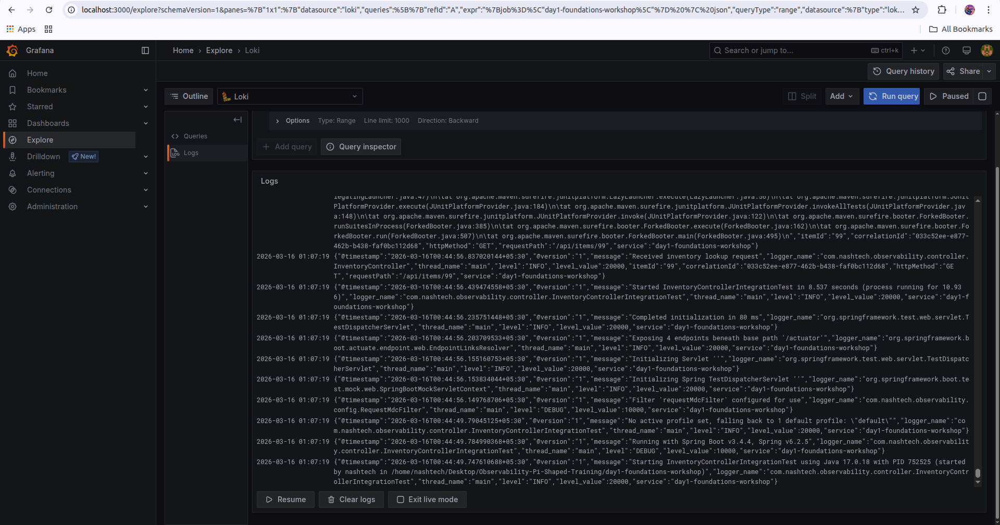
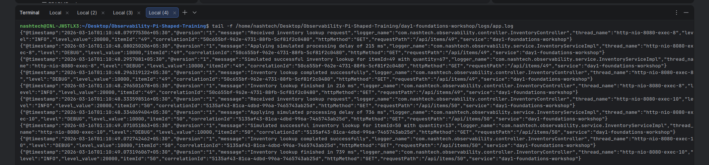

# Day 1 Foundations Workshop: Logs and Metrics

## 1. Assignment Objective
Build an observable Spring Boot REST API that emits realistic telemetry under both normal and failure conditions, and visualize logs and metrics using a local observability stack (Prometheus, Loki, Grafana).

This implementation provides:
- A simulated Inventory API endpoint: `GET /api/items/{itemId}`
- Random delay and random failure injection for realistic traffic behavior
- Structured JSON logging with MDC context
- Prometheus metrics exposure using Spring Actuator
- A custom dimensional counter with dynamic `status` tags (`success`, `error`)
- Grafana dashboards and Loki Explore queries
- Integration tests validating metric behavior in success and error scenarios

---

## 2. Project Structure

```text
day1-foundations-workshop/
├── docker-compose.yml
├── observability/
│   ├── grafana/provisioning/...
│   ├── loki/loki-config.yml
│   ├── prometheus/prometheus.yml
│   └── promtail/promtail-config.yml
├── src/main/java/com/nashtech/observability/
│   ├── config/RequestMdcFilter.java
│   ├── controller/InventoryController.java
│   ├── exception/GlobalExceptionHandler.java
│   ├── metrics/RequestMetrics.java
│   └── service/InventoryServiceImpl.java
├── src/main/resources/
│   ├── application.properties
│   └── logback-spring.xml
├── src/test/java/com/nashtech/observability/controller/
│   └── InventoryControllerIntegrationTest.java
└── docs/screenshots/
```

---

## 3. Technology Stack
- Java 17
- Spring Boot 3.4.4
- Spring Web + Spring Actuator
- Micrometer + `micrometer-registry-prometheus`
- Logback + `logstash-logback-encoder`
- Prometheus + Loki + Promtail + Grafana (Docker Compose)
- JUnit 5 + MockMvc + Spring Boot Test

---

## 4. Functional Behavior Implemented

### API Endpoint
- `GET /api/items/{itemId}`
- Returns item payload with:
  - `itemId`
  - `itemName`
  - `availableQuantity`
  - `timestamp`

### Realistic Simulation
- Random processing delay using configurable min/max milliseconds:
  - `app.simulation.min-delay-ms`
  - `app.simulation.max-delay-ms`
- Random error generation using configurable error rate:
  - `app.simulation.error-rate`
- Failure scenario returns `HTTP 500` with JSON error body and `correlationId`

---

## 5. Observability Implementation

### 5.1 Structured Logging (JSON)
- Configured in `src/main/resources/logback-spring.xml`
- Logs are written to:
  - Console (JSON)
  - File: `logs/app.log` (JSON)
- Log levels covered in endpoint flow:
  - `INFO`: request received, request completed
  - `DEBUG`: simulation and successful processing details
  - `ERROR`: simulated failure with stack trace

### 5.2 MDC Usage
MDC keys added per request:
- `correlationId`
- `httpMethod`
- `requestPath`
- `itemId`

`RequestMdcFilter` handles correlation ID generation/propagation via `X-Correlation-Id` header and clears MDC safely after request completion.

### 5.3 Actuator & Prometheus Metrics Exposure
- Added dependency:
  - `io.micrometer:micrometer-registry-prometheus`
- Actuator endpoint enabled:
  - `GET /actuator/prometheus`
- Configuration in `src/main/resources/application.properties`:
  - `management.endpoints.web.exposure.include=health,info,metrics,prometheus`

### 5.4 Custom Dimensional Metric
Custom counter:
- Metric name: `inventory_requests_total`
- Dynamic tag:
  - `status="success"` for successful request completion
  - `status="error"` for simulated failed requests

Metric is incremented inside controller logic for both success and failure paths.

---

## 6. Local Observability Stack

`docker-compose.yml` provisions:
- Prometheus (`localhost:9090`)
- Loki (`localhost:3100`)
- Promtail (log shipper for `logs/app.log`)
- Grafana (`localhost:3000`, default `admin/admin`)

Grafana provisioning includes:
- Prometheus datasource
- Loki datasource
- Preloaded dashboard: `Day1 Observability Dashboard`

---

## 7. Run Instructions (Step-by-Step)

From project root:

```bash
cd /home/nashtech/Desktop/Observability-Pi-Shaped-Training/day1-foundations-workshop
```

### Step 1: Run tests

```bash
mvn clean test
```

If local Maven cache causes issues:

```bash
mvn -Dmaven.repo.local=/tmp/.m2 clean test
```

### Step 2: Start Spring Boot app

```bash
mvn spring-boot:run
```

### Step 3: Start observability stack (new terminal)

```bash
docker compose up -d
docker compose ps
```

### Step 4: Generate sample traffic (new terminal)

```bash
for i in $(seq 1 50); do curl -s -o /dev/null -w "%{http_code}\n" http://localhost:8080/api/items/$i; done
```

You should see a mix of `200` and `500` status codes.

---

## 8. Verification Commands

### API and Actuator

```bash
curl -i http://localhost:8080/api/items/1001
curl -i http://localhost:8080/actuator/health
curl -s http://localhost:8080/actuator/prometheus | grep inventory_requests_total
```

### Structured JSON logs in terminal

```bash
tail -f logs/app.log
```

### Grafana / Prometheus / Loki checks
- Grafana: `http://localhost:3000`
- Prometheus UI: `http://localhost:9090`
- Loki endpoint: `http://localhost:3100`

Prometheus query:

```promql
sum by (status) (inventory_requests_total)
```

Loki Explore query:

```logql
{job="day1-foundations-workshop"} | json
```

Loki error-only filter:

```logql
{job="day1-foundations-workshop", level="ERROR"} | json
```

---

## 9. Testing Coverage

Integration tests in:

`src/test/java/com/nashtech/observability/controller/InventoryControllerIntegrationTest.java`

Test cases:
1. Success path increments `inventory_requests_total{status="success"}`
2. Error path increments `inventory_requests_total{status="error"}`

These tests validate metric increments independent of API outcome.

---

## 10. Screenshots (Visual Proof)

### A) Grafana Dashboard - Custom Counter with Dynamic Tags
Expected panel should show `status=success` and `status=error`.



Grafana-Custom-Dashboard.png

### B) Grafana Explore - Loki JSON Structured Logs
Expected query in Explore:
`{job="day1-foundations-workshop"} | json`






### C) Terminal Output - Raw JSON Structured Logs
Capture output from:
`tail -f logs/app.log`



---

## 11. Day 2 Advanced Workshop: Distributed Tracing (Micrometer + OpenTelemetry)

### 11.1 Objective Covered
This Day 2 implementation extends the Day 1 API with distributed tracing and cross-tool correlation:
- Incoming requests now generate `traceId` and `spanId`
- Traces are exported using OTLP
- OpenTelemetry Collector forwards spans to Grafana Tempo
- Logs in Loki include trace context, enabling Log → Trace navigation
- A custom nested span (`validateStock`) is added with attribute `item.id={itemId}`

### 11.2 Trace Pipeline

```text
Spring Boot App
  -> Micrometer Tracing (OpenTelemetry bridge)
  -> OTLP Exporter (HTTP, :4318)
  -> OpenTelemetry Collector
  -> Grafana Tempo
  -> Grafana Explore / Trace View
```

### 11.3 Day 2 Dependencies Added
In `pom.xml`:
- `io.micrometer:micrometer-tracing-bridge-otel`
- `io.opentelemetry:opentelemetry-exporter-otlp`

### 11.4 Day 2 Application Configuration
In `src/main/resources/application.properties`:
- `management.tracing.enabled=true`
- `management.tracing.sampling.probability=1.0`
- `management.otlp.tracing.endpoint=${OTEL_EXPORTER_OTLP_ENDPOINT:http://localhost:4318/v1/traces}`

### 11.5 Log Correlation (Day 1 -> Day 2)
`logback-spring.xml` now explicitly includes MDC keys:
- `traceId`
- `spanId`
- (plus existing `correlationId`, `httpMethod`, `requestPath`, `itemId`)

This allows correlation of one failing log line in Loki to the same failed trace in Tempo.

### 11.6 Custom Span with Attribute
Inside `InventoryServiceImpl#fetchItem(...)`, a custom span is created:
- Span name: `validateStock`
- Custom attribute/tag: `item.id={itemId}`

This span appears as a nested operation in the Tempo trace Gantt chart.

### 11.7 OpenTelemetry Collector + Tempo
New stack components in `docker-compose.yml`:
- `otel-collector` (`4317`, `4318`)
- `tempo` (`3200`)

New configs:
- `observability/otel-collector/otel-collector-config.yml`
- `observability/tempo/tempo.yml`

Grafana datasource provisioning now includes:
- `Tempo` datasource
- Loki derived field for `traceId` -> clickable trace link in Tempo

### 11.8 Day 2 Run and Verification

1. Start observability stack:

```bash
docker compose up -d
docker compose ps
```

2. Run Spring Boot:

```bash
mvn spring-boot:run
```

3. Generate mixed success/failure requests:

```bash
for i in $(seq 1 40); do curl -s -o /dev/null -w "%{http_code}\n" http://localhost:8080/api/items/$i; done
```

4. Verify traces in Tempo (Grafana Explore -> Tempo):
- Search recent traces for service `day1-foundations-workshop`
- Open a trace and confirm nested span `validateStock`

5. Verify failed span:
- Trigger until a `500` occurs
- Open that trace in Tempo and confirm failed span (red) with exception details

6. Verify log-trace correlation:
- In Loki Explore query:

```logql
{job="day1-foundations-workshop"} | json
```

- Open a log line containing `traceId`, then open the same trace in Tempo via derived field.

### 11.9 Visual Proof (Screenshots Required for Submission)

Add these screenshots under `Screenshots/` before final submission:
- `Screenshots/Tempo-Gantt-Full-Trace.png`
  - Full request lifecycle trace including custom nested span `validateStock`
- `Screenshots/Tempo-Failed-Span-500.png`
  - Failed (red) span for simulated HTTP 500 with visible exception stack trace
- `Screenshots/Loki-Tempo-Log-Trace-Correlation.png`
  - Log entry containing `traceId` and matching trace opened in Tempo

When screenshots are ready, keep these embedded references in this README:


